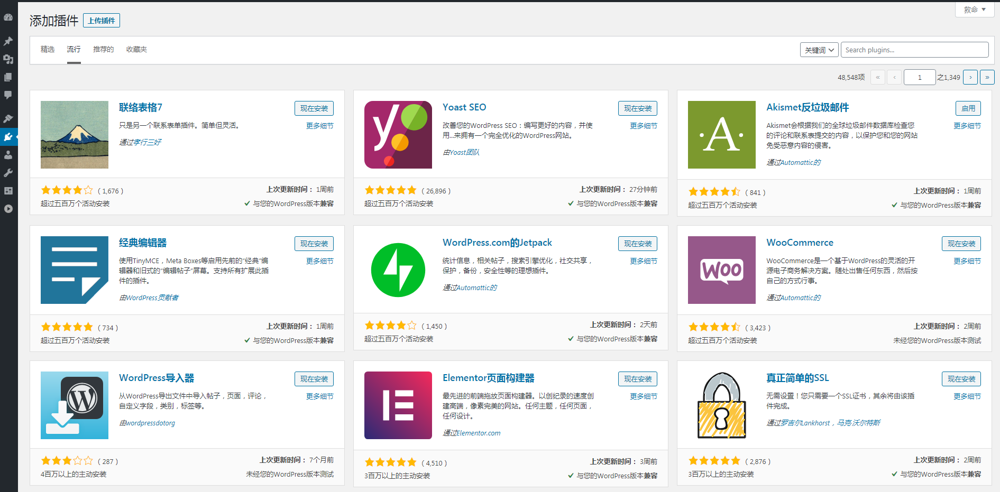

# Docker-compose 安装 Wordpress 博客

今天讲解一下新方式搭建 Wordpress，超级简单。使用 docker-compose 快速安装博客。

**先来说明一下两个概念：**

Docker：Docker 是一个开源的应用容器引擎，让开发者可以打包他们的应用以及依赖包到一个可移植的镜像中，然后发布到任何流行的 Linux或Windows 机器上，也可以实现虚拟化。容器是完全使用沙箱机制，相互之间不会有任何接口

Docker-compose：Docker-Compose 是 Docker 的一种编排服务，是一个用于在 Docker 上定义并运行复杂应用的工具，可以让用户在集群中部署分布式应用。 

- 服务 (`service`)：一个应用的容器，实际上可以包括若干运行相同镜像的容器实例。
- 项目 (`project`)：由一组关联的应用容器组成的一个完整业务单元，在 `docker-compose.yml` 文件中定义。

`Compose` 的默认管理对象是项目，通过子命令对项目中的一组容器进行便捷地生命周期管理。

## 一、博客搭建

### 1.前提

- linux 环境
- 安装 Docker，Docker-compose

### 2.linux 安装 docker

a.安装 docker

```bash
uname -r #查看你当前的内核版本
yum update #更新yum
yum -y install docker #安装 docker
systemctl start docker.service #启动 docker 服务
docker version #查看 docker版本
```

b.安装 docker-compose

```bash
yum install docker-compose #安装 docker-compose
docker-compose version #查看版本
```

### 3.安装 Wordpress

创建 docker-compose.yml

```bash
version: '3.3'
services:
   db:
     image: mysql:5.7
     volumes:
       - db_data:/var/lib/mysql
     restart: always
     environment:
       MYSQL_ROOT_PASSWORD: somewordpress
       MYSQL_DATABASE: wordpress
       MYSQL_USER: wordpress
       MYSQL_PASSWORD: wordpress
   wordpress:
     depends_on:
       - db
     image: wordpress:latest
     ports:
       - "8000:80"
     restart: always
     environment:
       WORDPRESS_DB_HOST: db:3306
       WORDPRESS_DB_USER: wordpress
       WORDPRESS_DB_PASSWORD: wordpress
       WORDPRESS_DB_NAME: wordpress
volumes:
    db_data: {}
```

执行命令：

```bash
docker-compose -f docker-compose.wordpress.yml up -d #后台运行
docker-compose -f docker-compose.wordpress.yml down #停止并删除服务
```

访问地址：`IP:8000` 

注：如果无法访问，腾讯云/阿里云，记得开启8000端口。 

### 4.Wordpress 搭建效果

#### 1.后台管理页面

后台访问地址：`IP:8000/wp-admin` ：


#### 2.前端管理页面 

前台访问地址：`IP:8000/`：

我刚刚搭建的博客地址（这里我修改了一下端口）：<http://47.93.246.180:9001/> 

 

#### 3.基础属性设置

在这里设置web页面的基本属性，例如站点标题，副标题，站点的语言，日期格式等。


## 二、Wordpress 设置

### 1.设置主题

进入`wordpress` 后台管理页面：<http://IP:port/wp-admin/> 


打开主题页面，主题任你选择。


### 2.添加文章

在这里添加文章。


### 3.安装插件

丰富的插件市场，任由你来挑选！



### 4.SEO优化

- 网站的标题(title)、描述(description)、关键词(keywords) 的设置。
- 添加网站地址`sitemap.xml `，百度，谷歌都可以添加。
- 网站添加https协议，提供网站安全等级。
- 图片优化，注意图片不能太大，并给图片添加 alt属性。

## 三、最后

认识docker 也有三年了，现在我也成为一位 docker 的痴迷者。docker 让我们不用再考虑服务器环境，直接运行先前打包好的镜像即可，操作非常简单。

看到这里你是不心痒痒了，快来动动手指，点点鼠标搭建属于自己的 Wordpress 博客吧！

## 附录：

1.docker-compose安装worpress: <https://docs.docker.com/compose/wordpress/> 

2.wordpress搭建教程: <https://themeforwp.net/archives/wordpress-website-tutorial/> 

3.18款wordpress插件: <https://themeforwp.net/archives/essential-wordpress-plugins/> 

4.wordpress seo优化: <https://themeforwp.net/archives/wordpress-seo/> 

5.wordpress 免费主题: <https://themeforwp.net/archives/best-wordpress-free-theme/> 