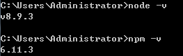
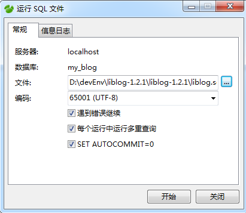
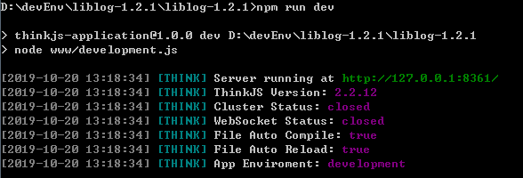
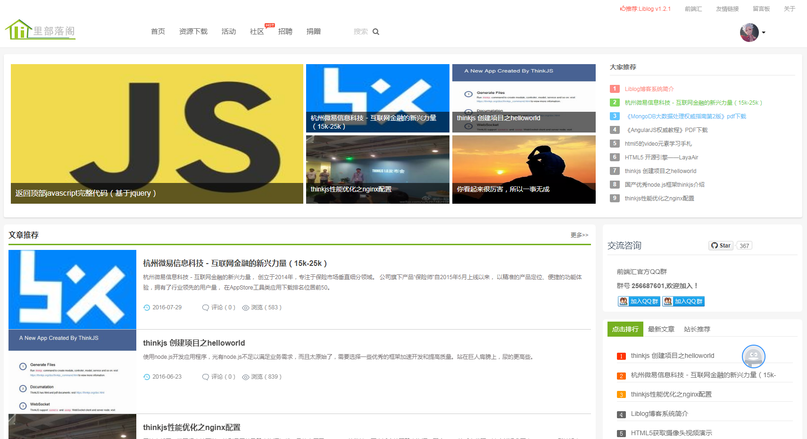
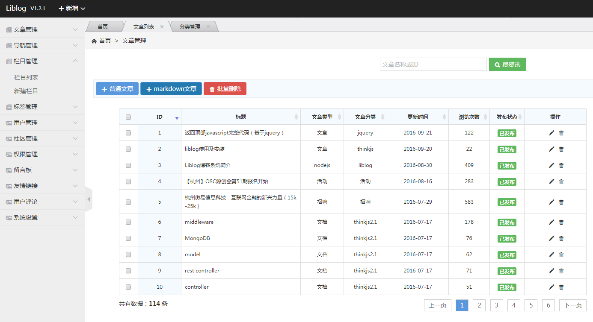
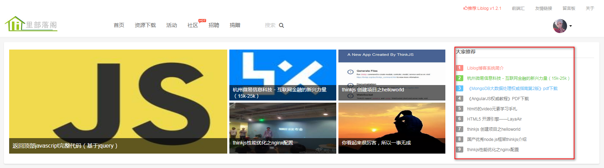
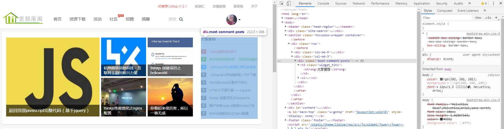
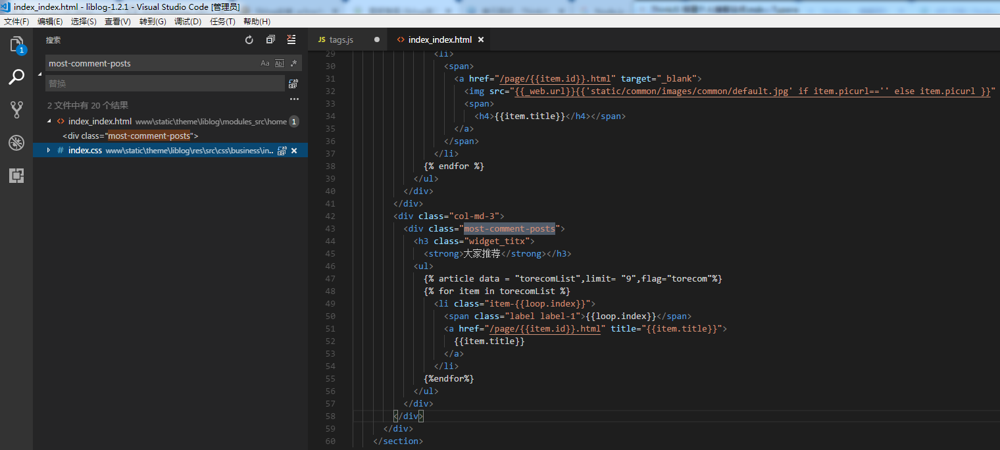
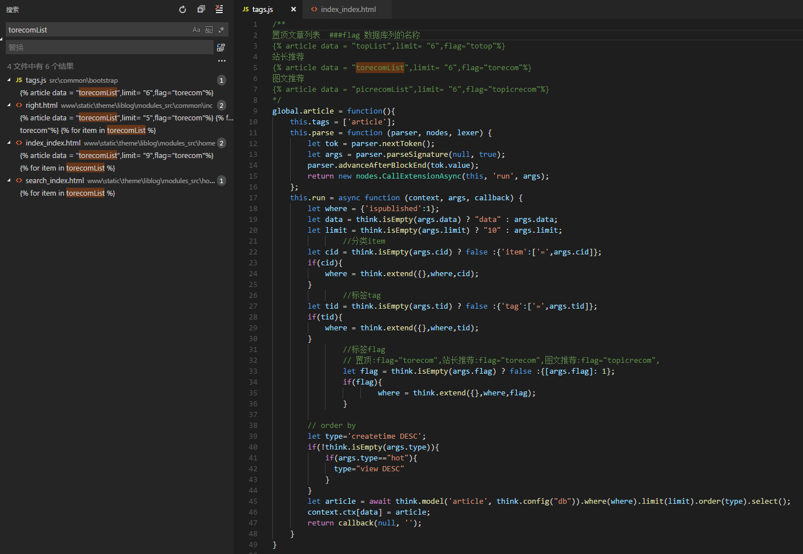
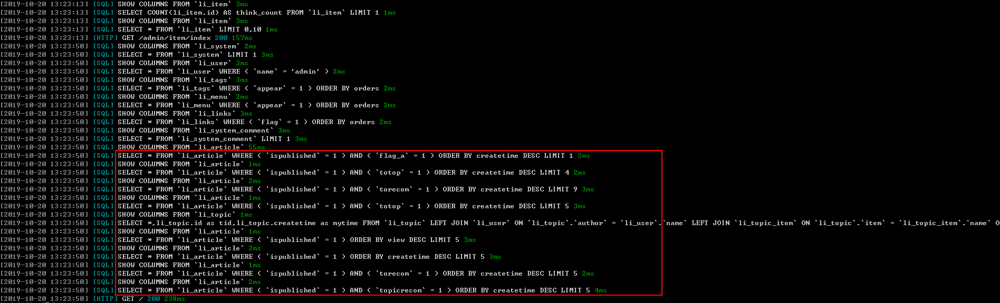

## ThinkJS 搭建个人博客站点

ThinkJS 是一款使用 ES6/7 特性全新开发的 Node.js MVC 框架，它综合了众多框架的设计理念和思想，让使用 Node.js 开发项目更加简单、高效。Node.js 是一个能够在服务器端运行JavaScript的开放源代码、跨平台 JavaScript 运行环境。Node.js 采用 Google 开发的 V8 运行代码，使用事件驱动、非阻塞和异步输入输出模型等技术来提高性能。


## 一、环境搭建

1.下载源码

打开Git Bash，克隆项目

```bash
git clone https://github.com/livisky/liblog.git
```

2.安装项目依赖

确保本地已安装 Node.js，Node.js 版本要大于 4.0 解压安装包 

Node.js下载地址：<http://nodejs.cn/download/> 



在项目根目录，打开CMD窗口执行：

```bash
npm install #安装依赖
```

3.项目配置

3.1导入数据库

创建数据库 my_blog，执行项目演示数据 liblog.sql 



3.2修改配置文件

打开 src/common/config/db.js，需要修改的内容：ip地址，端口，数据库名，账号和密码。

```json
export default {
  type: 'mysql',
  log_sql: true,
  log_connect: true,
  adapter: {
    mysql: {
      host: '127.0.0.1',      #数据库ip地址
      port: '3306',           #端口
      database: 'my_blog',    #数据库名
      user: 'root',           #账号
      password: 'root',       #密码
      prefix: 'li_',
      encoding: 'utf8'
    },
    mongo: {
    }
  }
};
```

4.本地启动

在项目根目录，打开 CMD 窗口，执行命令：

```bash
npm run dev  //运行开发环境代码(未压缩)
npm run app  //运行生产环境代码(压缩)
npm run compile
npm run compress //生成生产环境目录
```



看到启动日志，前端访问地址是：<http://127.0.0.1:8361/> 

前台登陆：admin@jsout.com 123456 

效果如下图：



后端的访问地址：<http://127.0.0.1:8361/admin> 

后台登陆：admin 123456 

效果如下图：



## 二、阅读源码

### 1.个人经验总结

工作经验的积累，越多更多的项目源码后，我总结了一套快速掌握源码的方法。

- 让项目运行起来。
- 选择一个小功能，掌握数据是如何流转的。
- 大胆假设和猜想。
- 越多官网文档，资料验证自己的假设。

### 2.举例说明

我想知道项目中 “大家推荐”这块功能是怎么实现的？



2.1选择前端元素

获取“大家推荐”前端元素的样式：class="most-comment-posts" 



2.2代码中查找元素所在位置

找到两个文件 index_index.html，index.css，很明显页面是i ndex_index.html



阅读源码内容可知，“大家推荐 ” 这个板块的数据是 torecomList 数据遍历显示的，所以继续寻找 torecomList  数据是从何而来？

2.3查找 torecomList 的来源

获取数据一般是要和后台交互的，大部分情况返回 torecomList 数据是在 js文件的，所有定位到 tags.js



阅读上面的这段代码，你可能看懂了一些内容，但是还不太清楚。

解释说明：

1.{% article 就类似于<input>,猜想是个自定义标签 。 data，limit， flag是它的属性。

```javascript
 
```

看控制台数据日志可知，limit：查询数据的条数，topicrecom：数据库列名称。



2.global.article = function() 是查询 mysql数据的方法

```javascript
let article = await think.model('article', think.config("db")).where(where).limit(limit).order(type).select(); #查询数据
 context.ctx[data] = article;
```

这段代码可知，将查询文章的数据几个赋值给data属性，所以 data 属性就是返回的数据集合。

## 三、最后

个人博客搭建的方式有很多种，本篇提供给你通过 Node.js 项目搭建博客的方式。Node.js 我也不懂，都是“拿来主义”，因为我觉得，学习一个人的优点，能100%的模仿是最快成长的方式。所有文章前半段基本是官方文档，后半段写了我学习别人源码的方式，讲的的有不对的地方大家指正！


### 附录：

1. liblog简介 ：<https://www.w3cschool.cn/liblog/liblog-rcw32288.html> 
2. ThinkJS官方文档：<https://thinkjs.org/zh-cn/doc/2.2/model_crud.html> 
3. Node.js 官方文档：<http://nodejs.cn/api/> 