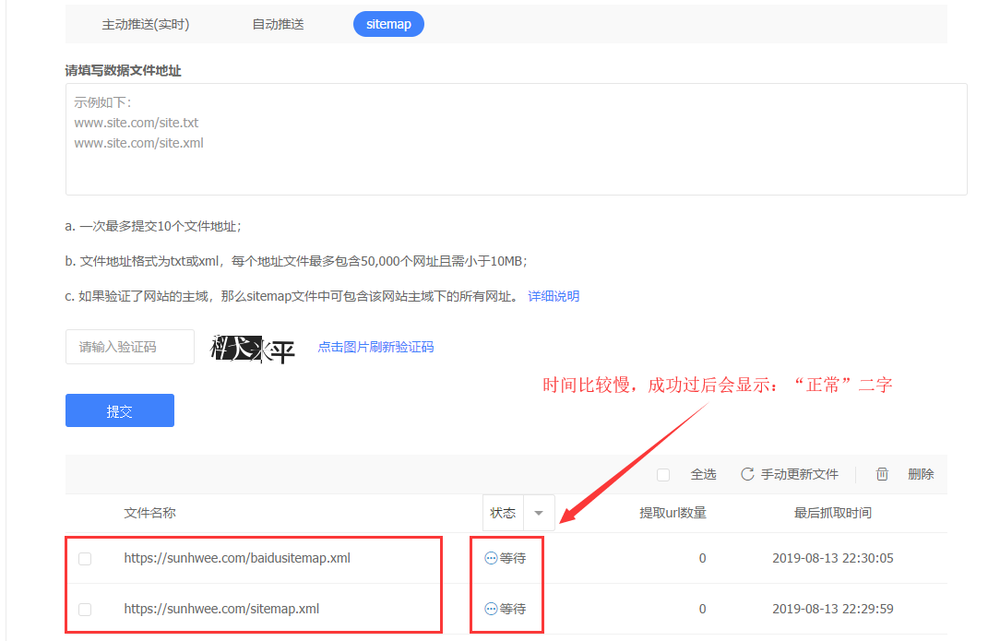

Github + hexo matery 主题搭建免费博客

## 为什么要搭建博客？

别人吐槽我现有的博客就是远古的博客，页面太low！另外一个原因是博客的内容是存储在数据库中，前段时间我的数据库被黑了，博客的内容全没了！基于这两个原因我在思考重新搭建我的博客。看到身边人的博客都那么漂亮，我也最终选择了hexo。hexo 是一款基于 Node.js 的静态博客框架。目前在GitHub上已有 28144 star 和 3721 fork。 

这是我上半年通过源码搭建的博客，地址是：<http://www.mhtclub.com/> 。如下图：


这是我新搭建的博客，地址是：<https://www.restlessman.cn/> ，效果如下图：


### 我觉得 hexo 框架的优点有：

1.不需要数据库，直接解析 markdown 文档内容，所以只关注写文章就好。

2.超级多的主题可自由选择。

3.超级多的插件，无所不能。留言板，聊天，阅读量统计，url 短连接转化等等。

## 博客搭建步骤

### 1.基础环境配置

安装 Git，Git是开源的分布式版本控制系统，用于敏捷高效地处理项目。 	

1.1 本地生成 ssh 密钥文件 

```
ssh-keygen -t rsa -C "你的GitHub注册邮箱"
```

在 Github 个人设置中心，新建一个 SSH key。“SSH and GPG keys ” -> "New SSH key " 


最后在 Git Bash 中检测 GitHub 公钥设置是否成功，输入 ssh git@github.com 


如上图所示，就表示配置成功。

1.2 安装Node.js

下载Node.js 安装程序，官网地址：<https://nodejs.org/en/download/> 


1.3 安装 hexo

```
npm install -g hexo-cli   #使用npm命令安装Hexo
hexo init blog    #初始化博客
hexo new test_my_site   #创建博客本地项目test_my_site
hexo g   #hexo博客打包
hexo s   #hexo博客启动
```

然后在浏览器访问：localhost:4000 ，就可以看到刚刚创建的博客了。

### 2.选择主题

hexo 的主题超级丰富，很多人都使用的 next 网上也有很多教程。

hexo themes主题官网：  <https://hexo.io/themes/index.html> 

上周无意间发现一位兄弟的博客是通过 matery 主题搭建的，让我眼前一亮，我的主题就是它了。


### 3.markdown 文档内容修改

修改本地 markdown 文档，使用 front-matter 语法，修改文章头格式：

```json
---
title: Vue + SpringCloud之后端实战经验分享
date: 2018-09-07 09:25:00
author: 不安分的猿人
img: /medias/markdownimages/vue.png
top: true
cover: true
coverImg: /medias/markdownimages/vue.png
summary: 概要
categories: Vue
tags:
  - SpringCloud
  - Vue
---
```

### 3.安装插件

3.1 推送网站内容到 Github 安装插件 hexo-deployer

```bash
npm install hexo-deployer-git --save   #本地安装hexo-deployer插件
hexo clean  #清除本地db
hexo g -d    #推送代码到远端
```

3.2 安装短地址链接插件

```bash
npm install hexo-abbrlink --save  #本地安装hexo-abbrlink插件
```

项目环境下 _config.yml 文件添加如下内容：

```
permalink: :abbrlink/
abbrlink:
  alg: crc32  # 算法：crc16(default) and crc32
  rep: hex    # 进制：dec(default) and hex
permalink_defaults:
```

### 4.SEO优化

4.1 百度收录你的网站


4.2 生成网站地图，向百度提交链接

生成网站地图，需安装插件sitemap插件

```bash
npm install hexo-generator-sitemap --save
npm install hexo-generator-baidu-sitemap --save
```

执行 hexo g  在项目根目录会生成，sitemap.xml`文件和`baidusitemap.xml文件。通过www.webname.com/sitemap.xml 检查文件是否生成。

向百度提交提交链接，操作如下：

 

4.3 让 Google 收录你的站点

google 站点平台：[https://www.google.com/webmasters/](https://link.zhihu.com/?target=https%3A//www.google.com/webmasters/) 


## 结语

hexo 可以让你快速上手搭建博客，要想设计自己独有的风格博客，那就需要花费点时间。本编讲解的内容都很基础，有兴趣的伙伴可以动动手，半个小时就可以拥有你自己的博客网站。当然在博客搭建上有什么问题可以告诉我，我们一起进步，互相学习！

## 参考

1. matery主题创作者的博客     <https://blinkfox.github.io/> 
2. Hexo SEO优化教程             <https://zhuanlan.zhihu.com/p/80140893> 
3. hexo-abbrlink插件安装        <https://ergou.fun/posts/733.html> 